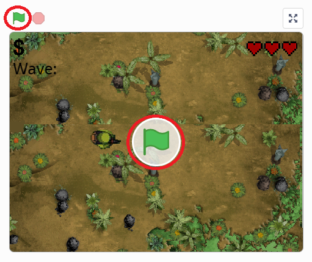
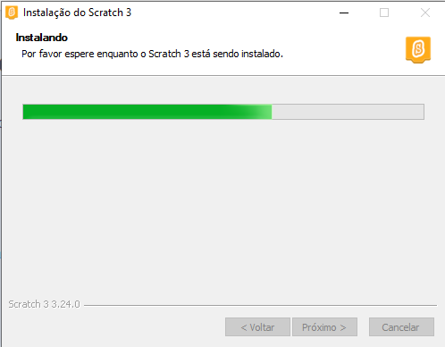

# Way of Peace

  
  
      
   
   
 
  
  
   

<h1 align="center">
    
</h1>

<h4 align="center"> 
	🚧  Way of Peace Concluído 🚧
</h4>

 <a href="#-sobre-o-projeto">Sobre</a> •
 <a href="#-como-executar-o-projeto">Como executar</a> • 
 <a href="#-tecnologias">Tecnologias</a> • 
 <a href="#-contribuidores">Contribuidores</a> •
 <a href="#-autor">Autor</a> • 
 <a href="#-licença">Licença</a>

## 🎮 Sobre o projeto

Way of Piece é um jogo criado na disciplina de Introdução a Engenharia da Computação no primeiro período do curso de Engenharia da Computação. O projeto foi desenvolvido utilizando a plataforma **[Scratch](https://blog.rocketseat.com.br/primeira-next-level-week/)** do **MIT**. O objetivo era tornar, por meio da programação em blocos, um primeiro contato agravável aos alunos com a programação. 

---

## 🚀 Como executar o projeto

Este projeto pode ser executado de duas formas:
1. Direto no site da plataforma [Scratch](https://scratch.mit.edu/projects/303772031).
2. Fazendo o [download](https://scratch.mit.edu/download/) do editor offline no site.

### Pré-requisitos

#### 🧭 Direto na plataforma

#### Para acessar o jogo na plataforma online basta clicar no [link](https://scratch.mit.edu/projects/303772031) e em seguida clicar na bandeira verde como na imagem abaixo:

#### 🧭 Fazendo o download do editor:

#### Para jogar de forma offline, é necessário fazer o [download](https://scratch.mit.edu/download/) do editor do **Scratch** e prosseguir com sua instalação como na imagem abaixo:

#### Após a instalação, clique em **Arquivo**, escolha a opção **Carregar do seu computador** e selecione o arquivo **[Way of Peace.sb3](https://github.com/AdrianDamiao/ScratchGame/raw/main/Way%20of%20Peace.sb3)**. 

#### Para jogar só resta clicar na bandeira verde e ser feliz.

---

## 🛠 Tecnologias

As seguintes ferramentas foram usadas na construção do projeto:

-   **[Scratch MIT](https://scratch.mit.edu/download/)**
-   **[Photoshop CS6](https://www.adobe.com/br/products/photoshop.html)**

---

## 👨‍💻 Contribuidores

💜 Sinceros agradecimentos a **[Warfame](https://scratch.mit.edu/users/warfame/)** pela ajuda na criação deste jogo :)

---

## 🦸 Autor

 <a href="https://github.com/AdrianDamiao">
 
  
 <b>Adrian Damião</b></a> 
  
 
 

---

## 📝 Licença

Este projeto esta sobe a licença [MIT](./LICENSE).

---
